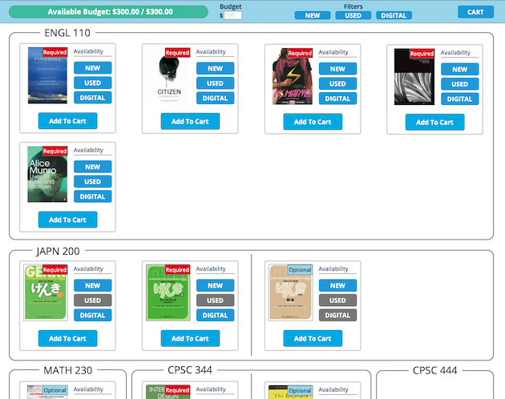
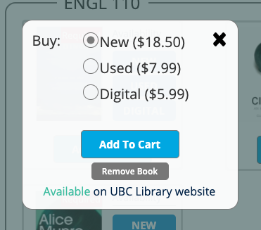
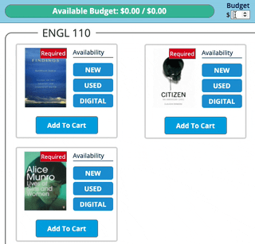
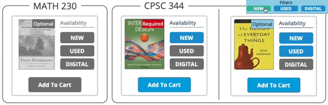
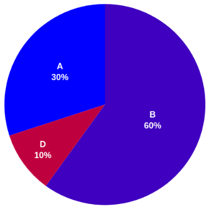
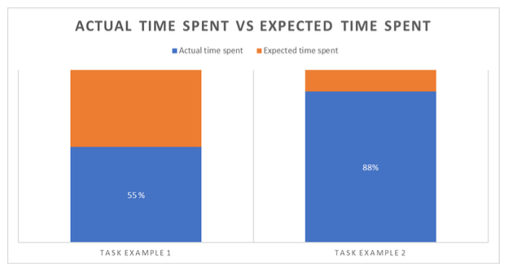

For CPSC 344, we were tasked with developing a new interface for a website of our choice, as well as evaluating our prototype design. We chose the UBC Bookstore's textbook purchasing section, which several of our group had previously researched. Based on their research, the design needed automatic generation of booklists, clearer information about book formats (i.e. new, used, digital, etc.) and more support for users on a budget.

Our team developed several approaches to the design, and used those to create lo-fi prototypes for evaluation using a cognitive walkthrough. Based on that assessment, we decided on a design highlighting the student's remaining budget.

We developed a medium fidelity prototype for this design using Axure RP 10. This prototype is designed to demonstrate the main features of the design (budget bar, filtering, format indicators) assuming that booklist generation is handled on another page. Therefore, these features appear fully functional, but the prototype is limited to this single page.

Prototype overview

 
 

|  |
|:--:|
| Book selection panel, showing format availability and price |

 

|  |
|:--:|
| Demonstration of the budget bar feature |

 

|  |
|:--:|
| Demonstration of the filter feature |

Evaluation of our prototype consisted of a think-aloud remote observation and a questionnaire using the System Usability Scale (SUS) questions. The observation involved buying textbooks as two different personas, an international student trying to limit the use of physical books, and a 5th year student looking to stick to a lower textbook budget. The completion time for these tasks were estimated by the participant before attempting the task, and recorded by observers during task completion.

The evaluation results indicated a very usable and efficient interface. SUS results (in grade form) showed that most users found the interface to have good to great usability, and the time data indicates that users could complete purchasing faster than their generally low estimates (i.e. in less than a minute).

|  |
|:--:|
| Questionnaire SUS data in grade form |

 

|  |
|:--:|
| Graph of actual time required vs. user estimates |

